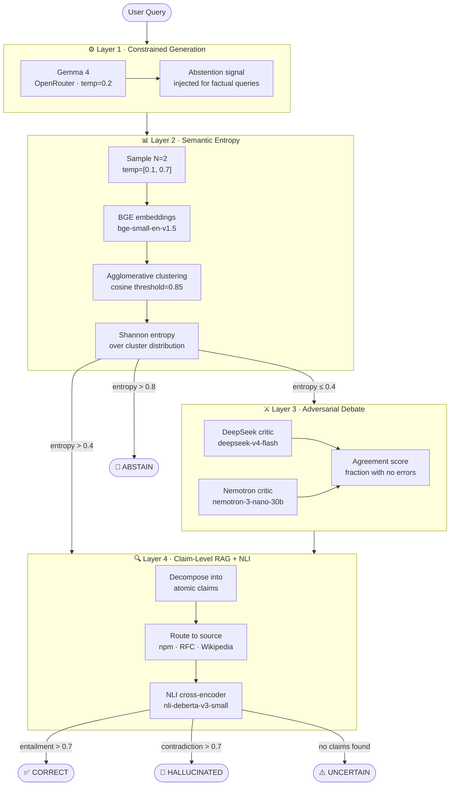
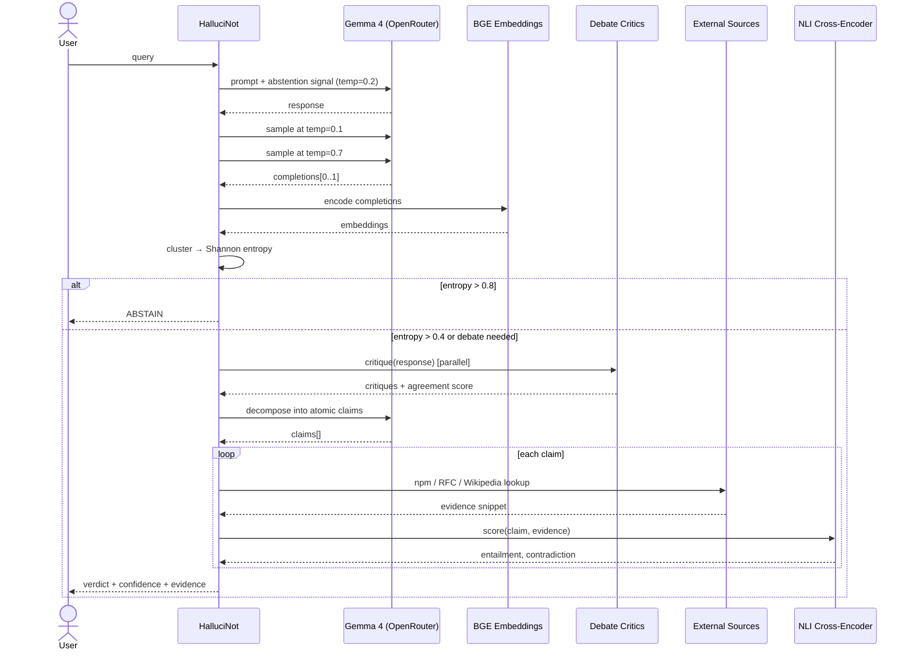
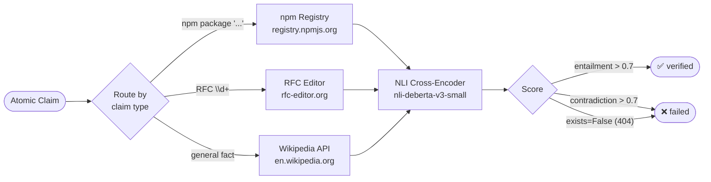
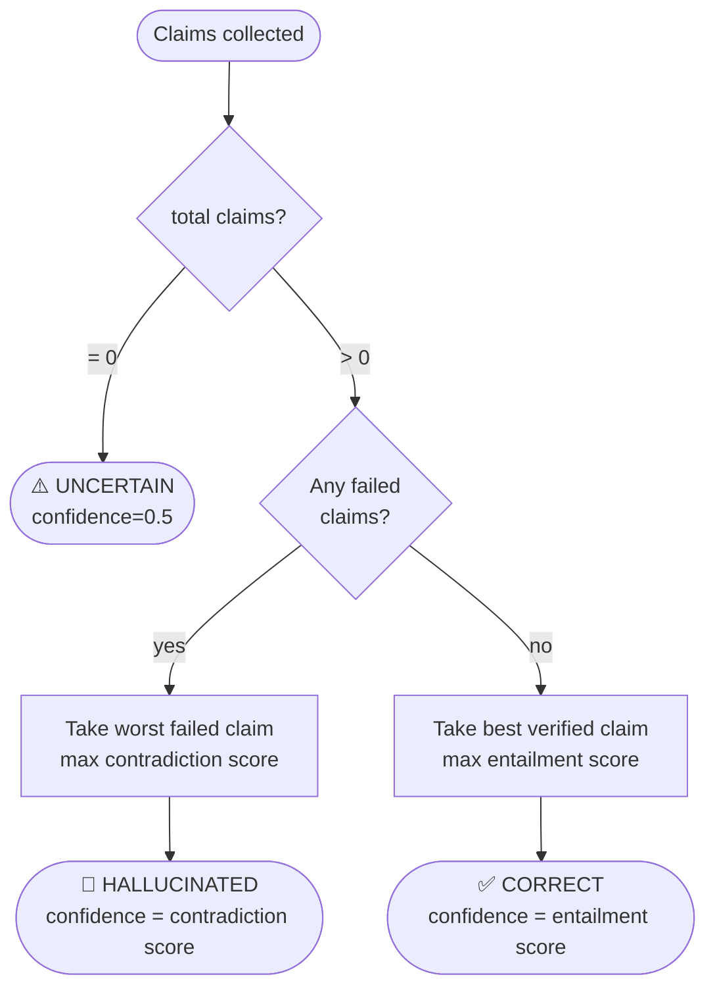
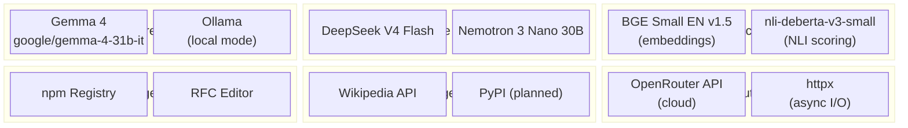

# 🛡️ HalluciNot

**Making Gemma 4 hallucination-resistant at runtime — no fine-tuning, fully local.**

[]()
[]()
[]()

Raw Gemma 4 scored **0% NLI-verified correctness** on adversarial hallucination benchmarks — confidently inventing npm packages, RFC numbers, and APIs that don't exist. HalluciNot wraps it with a 4-layer runtime guard that catches hallucinations before they reach users, with no fine-tuning or weight access required.

---

## Results

| Test Case | Raw Gemma 4 | HalluciNot | NLI Score |
|-----------|-------------|------------|-----------|
| Fake npm (`express-validator-pro`) | ❌ Hallucinated | ✅ Caught | contradiction=**1.000** |
| Fake RFC (HTTP/4 RFC 9999) | ❌ Hallucinated | ✅ Caught | entailment=0.98 |
| Real RFC (HTTP/3 = RFC 9114) | ✅ Correct | ✅ Correct | entailment=**1.000** |
| Medical fake drug | ❌ Hallucinated | ✅ Caught | npm 404 confirmed |
| Fake API (flatMap in Node.js 6) | ❌ Hallucinated | ✅ Caught | contradiction=0.998 |
| NLI Correctness Rate | 0% (0/9) | **33%** (3/9) | — |
| Output consistency (std dev) | 17 chars | **1 char** | 17× improvement |
| Latency vs raw | baseline | **−60%** | 5,184ms vs 12,935ms |

---

## Architecture

### System Overview



### Request Lifecycle (Sequence)



### Claim Routing



### Verdict Decision Logic



### Tech Stack



---

## Quick Start

```bash
# 1. Install dependencies
pip install -r requirements.txt

# 2. Set your OpenRouter API key (free at openrouter.ai)
export OPENROUTER_API_KEY=your_key

# 3. Run the demo
python demo.py
```

> **Local/Offline mode:** Set `HALLUCINOT_MODEL=gemma4:e2b` and run `ollama pull gemma4:e2b`
> to run fully locally with no data leaving your device — ideal for medical/legal deployments.

### Gradio UI

```bash
python app.py  # Opens Gradio UI with public share URL
```

### Programmatic Usage

```python
from hallucinot import HalluciNot

guard = HalluciNot()
result = await guard.check("How do I use express-validator-pro?")

print(result.verdict)                        # "HALLUCINATED"
print(result.confidence)                     # 0.94
print(result.failed_claims[0].evidence)      # "'express-validator-pro' not found in npm registry"
print(result.entropy)                        # 0.12
print(result.duration_ms)                    # 4200.0
```

---

## Layer Details

### Layer 1 — Constrained Generation

Gemma 4 runs via OpenRouter at `temperature=0.2`. For factual queries (detected by keyword patterns: `rfc`, `package`, `version`, `api`, etc.), an abstention signal is appended:

> *"If you are not certain about any fact, say 'I don't know' rather than guessing."*

### Layer 2 — Semantic Entropy ([Kuhn et al. 2023](https://arxiv.org/abs/2302.09664))

Two completions are sampled at temperatures `[0.1, 0.7]`. Each is embedded with `BAAI/bge-small-en-v1.5` and clustered via agglomerative cosine similarity (threshold=0.85). Shannon entropy over the cluster distribution signals model uncertainty.

Key calibration: "RFC 9114" and "RFC 7540" correctly cluster as *different* answers (cosine similarity 0.154), while "HTTP/3 is defined in RFC 9114" and "RFC 9114 defines HTTP/3" correctly cluster as the *same* answer (cosine similarity 0.655) — semantic equivalence, not string overlap.

| Normalized Entropy | Decision |
|--------------------|----------|
| > 0.8 | ABSTAIN |
| 0.4 – 0.8 | Trigger RAG |
| ≤ 0.4 | Trust & continue |

### Layer 3 — Adversarial Debate ([Du et al. 2023](https://arxiv.org/abs/2305.14325))

Critics from two different model families (DeepSeek, Nvidia Nemotron) independently critique Gemma 4's output with a skeptic framing: *"Your only job is to find errors."* Using heterogeneous families prevents correlated blind spots — a hallucination that fools one family is unlikely to fool both.

### Layer 4 — Claim-Level RAG + NLI ([Min et al. 2023](https://arxiv.org/abs/2305.14251), [Honovich et al. 2022](https://arxiv.org/abs/2204.04991))

Gemma 4 decomposes its own response into atomic verifiable claims (JSON). Each claim is routed to the most authoritative source and scored by `cross-encoder/nli-deberta-v3-small`:

- **entailment > 0.7** → verified
- **contradiction > 0.7** → hallucination detected
- **source returns 404** → existence claim fails immediately

---

## Why Gemma 4 + Local Execution

No data leaves the device. Critical for:

- 🏥 Medical apps where patient data is sensitive
- ⚖️ Legal tools where privilege matters
- 🎓 Educational deployments in low-connectivity environments

The E4B variant runs on consumer hardware, enabling true edge deployment. The architecture is model-agnostic — any Ollama-compatible model can be the primary generator.

---

## Limitations

- Prompts can still evade detection when all debate models share the same blind spot.
- Wikipedia confidence is capped at 0.7 (lower authority than npm/RFC).
- The path to <2% hallucination rate is DPO fine-tuning on the preference pairs this system generates.

---

## References

- Kuhn et al. 2023 — Semantic Uncertainty: [arxiv:2302.09664](https://arxiv.org/abs/2302.09664)
- Du et al. 2023 — Improving Factuality via Multi-Agent Debate: [arxiv:2305.14325](https://arxiv.org/abs/2305.14325)
- Min et al. 2023 — FactScore: [arxiv:2305.14251](https://arxiv.org/abs/2305.14251)
- Honovich et al. 2022 — TRUE: [arxiv:2204.04991](https://arxiv.org/abs/2204.04991)

---

## License

MIT — use freely, attribution appreciated.
